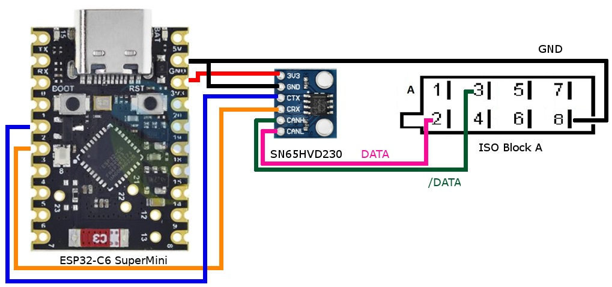

# ESP32 LP-Core Vehicle Area Network (VAN bus) writer

ESP-IDF [VAN bus][van_network] writer library utilizing the ESP32-C6 [ULP LP-Core][ulp_lp_core]. The aim of this library is to provide a software based solution to safely write to the VAN bus without a TSS463 or a TSS461 IC. Eventually these are going to be hard to obtain and the only option will be salvaging them from a used radio or BSI.

### Features
- Support for 125kbps bus (VAN COMFORT bus)
- Bus arbitration logic to safely write on the bus
- Sending "normal" type frames and "reply request" frames

### TODO
- Support for 62.5kbps bus (VAN BODY bus)
- Support to reply ACK for frames
- Support in-frame reply frames

### Not planned
There is no plan to extend the library to read the VAN bus. For that you can use my [VAN bus reader library using the RMT peripheral][esp32_rmt_van_rx]. You can use both libraries using the same rx pin.

### Schematics

The schematics below can be used to connect to a VAN bus. The SN65HVD230 is a CAN bus transceiver. You can use other CAN bus transceivers as well. Some examples: MCP2551, TJA1042, TJA1050, TJA1051, TJA1052. Note that some of these are 5V devices therefore a logic level converter to 3.3V should be used.



#### Example code
```cpp
#include "LpCoreVanTx.hpp"

#define VAN_RX_PIN GPIO_NUM_3
#define VAN_TX_PIN GPIO_NUM_2

LpCoreVanTx* vanTx;

vanTx = new LpCoreVanTx(VAN_RX_PIN, VAN_TX_PIN, LpCoreVanTx::LP_VAN_NETWORK_SPEED::LP_VAN_125KBPS);
vanTx->Start();

// Send a normal frame
uint8_t packet[7] = { 0x0F, 0x07, 0x81, 0x1D, 0xA4 ,0x93, 0x56 };
if (vanTx->IsTxPossible())
{
    vanTx->SendNormalFrame(0x8A4, packet, sizeof(packet), false);
}

if (vanTx->IsTxPossible())
{
    // Send a query type frame
    ulpVanTx->SendReplyRequestFrame(0x564);
}
```

## See also
- [VAN Analyzer for Saleae Logic Analyzer][van_analyzer]
- [TSS463/461 library for reading and also safely writing the VAN bus][tss_46x library]
- [VAN bus reader for ESP32 utilizing the RMT peripheral][esp32_rmt_van_rx]
- [VAN bus reader for STM32F103 (Blue Pill)][stm32_van_bus]

[van_network]: https://en.wikipedia.org/wiki/Vehicle_Area_Network
[van_analyzer]: https://github.com/morcibacsi/VanAnalyzer/
[esp32_rmt_van_rx]: https://github.com/morcibacsi/esp32_rmt_van_rx
[tss_46x library]: https://github.com/morcibacsi/arduino_tss463_van
[stm32_van_bus]: https://github.com/morcibacsi/stm32_arduino_van_bus
[ulp_lp_core]: https://docs.espressif.com/projects/esp-idf/en/stable/esp32c6/api-reference/system/ulp-lp-core.html
